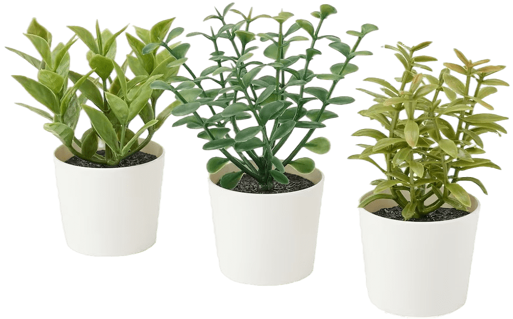

Repo of the robotics project, 2024 edition: Farming Mars,
from the Polytech Nice Sophia robotics team!
## Objectives
The purpose of the robot is to carry out several tasks in complete autonomy. The tasks to be performed are as follows:
- Pick up different types of plant

- Place plants in pots

- Bring plants to a predefined area

- Sort plants by type

> Two fragile plants, one resistant plant

- Orienting solar panels

All the work must be completed within the allotted time and without colliding with the environment (walls, other robots, plants, pots).

## constraints
- Robot dimensions :
    - Perimeter between 1200 and 1300 mm

    
    
    - Height under 350 mm

## Main components
- Chassis / Rolling base
- Gripper system (rail-mounted gripper)
- Vision systems (cameras, sensors)
- Storage system (turntable)
