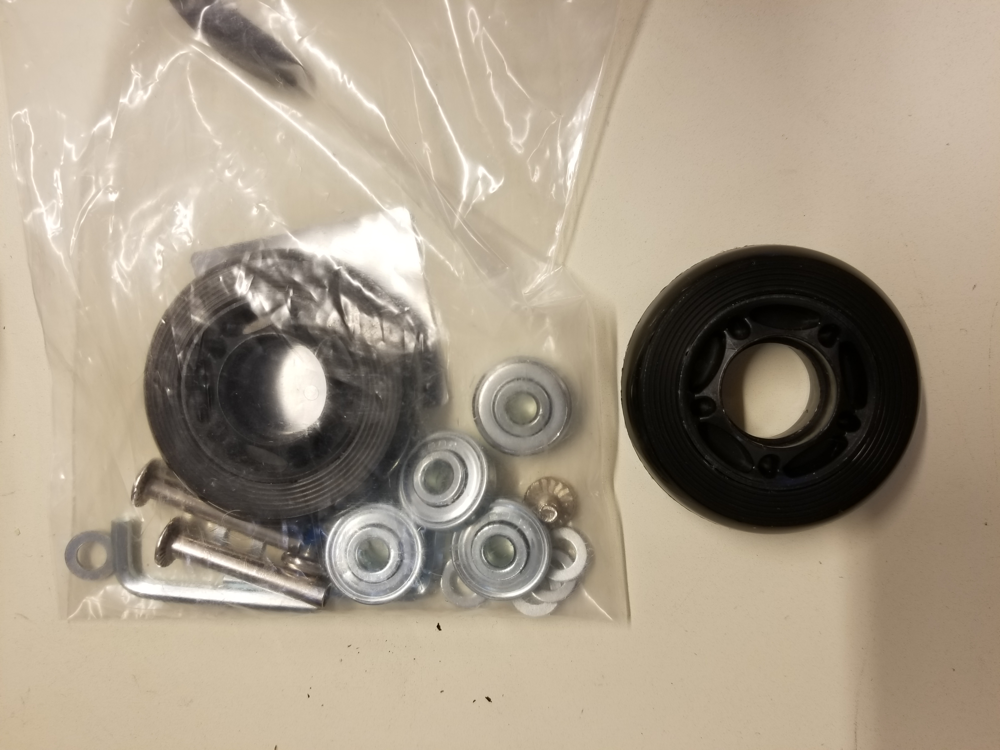
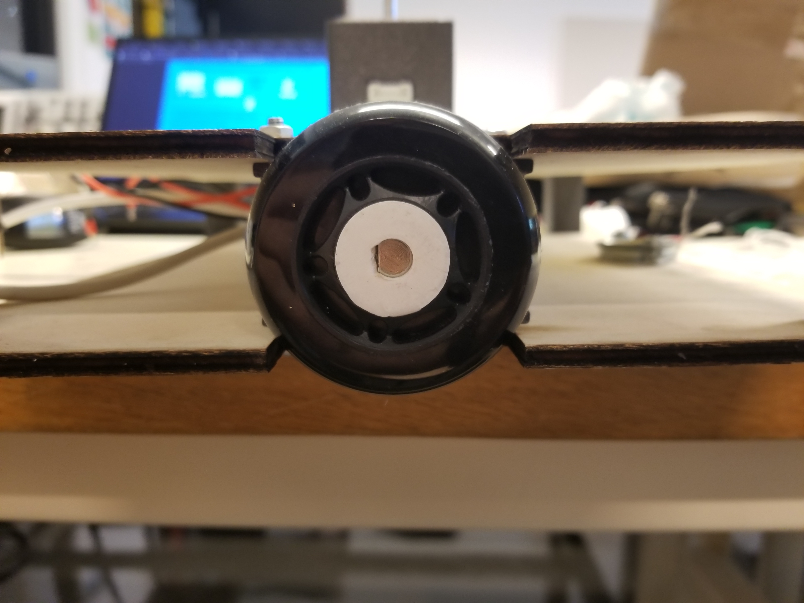
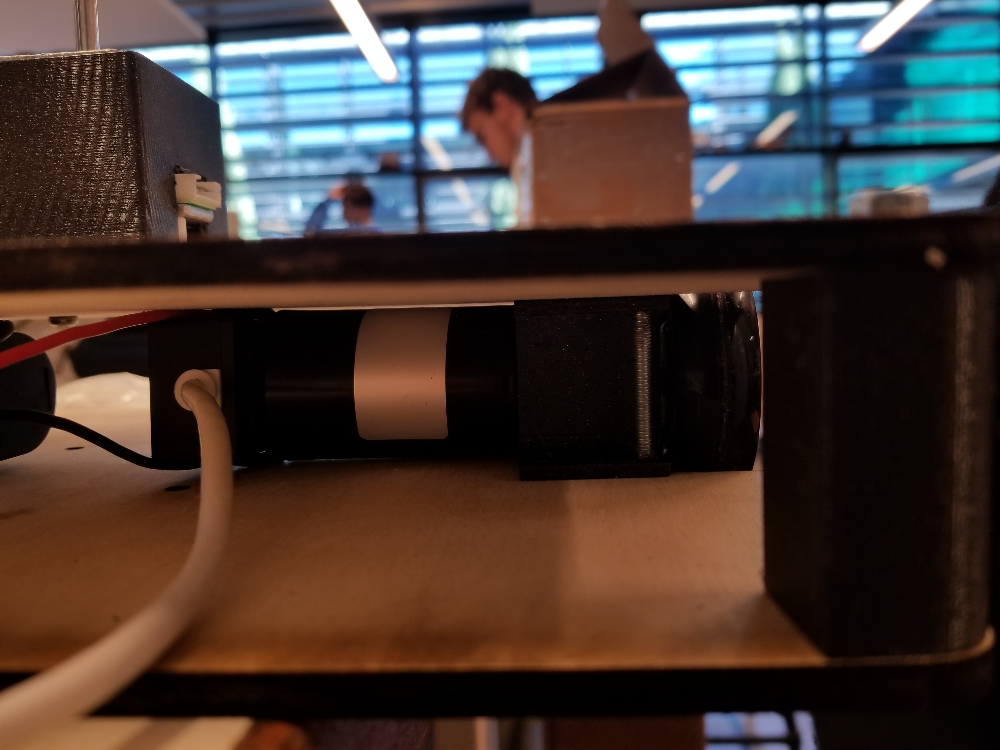
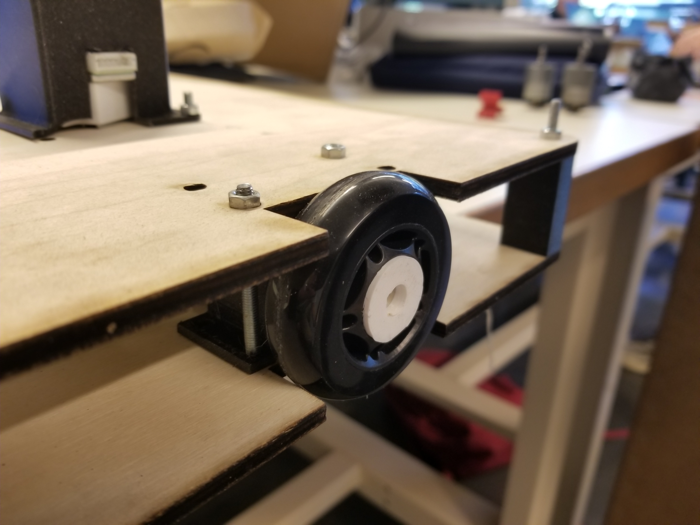
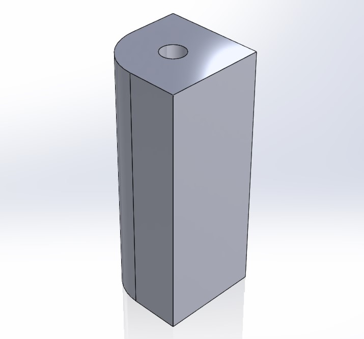
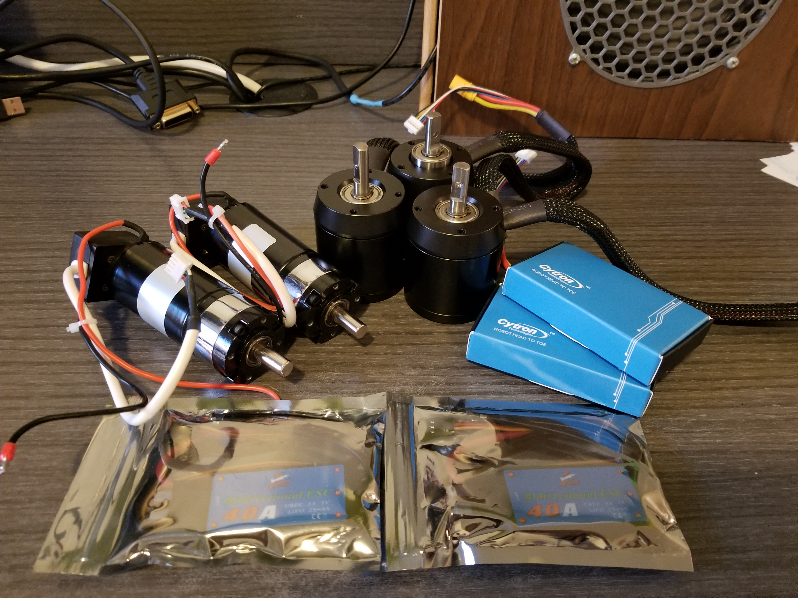
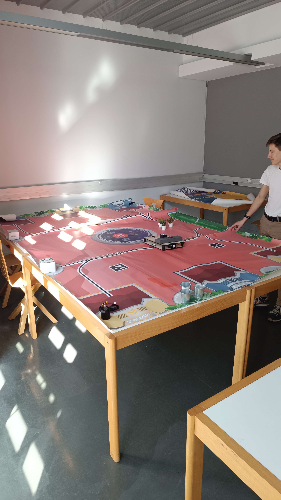

# October 14, 2023
## 3D modeling
### Wheel adapter
Based on the wheels we ordered from Amazon, I modeled in 3D and 3D printed an adapter to mount them on the motor shafts, as they are sold as rolleur wheels and are therefore freewheels (mounted with a bearing in the hub) and so we can't use them directly to transmit torque from the motor on which they are individually mounted.

  

To make these wheels suitable for our use, I simply removed the bearings from them and replaced them with a 3D printed (in PETG for reliability) adapter that fits the motor shafts. The wheels are then mounted on the motor shafts. In my original design, the adapter was screwed onto the motor shaft, but I had to modify it to make it press-fit because the hole for the screw (in red on the picture above) was not accessible because the wheel covered it. To make sure to have a tight fit, I 3D printed the adapter without any tolerance and I filed it down just a little bit to make it fit just enought to stay in place without risking to damage the motor shafts.

   

In order to transmit the motor torque, I designed the adapter with a flat surface identical to the one on the motor shaft. Because the wheels are only press-fit on the motor shafts, I will have to keep an eye on them to make sure they don't slip. I will have to solve this issue on the next version of the adapter.

   

> We can see a wheel in black, the 3D-printed adapter in white and a motor mounted on a previously-produced 3D-printed bracket, which in turn is screwed onto the laser-cut plywood frame.

### Motor mount
The motors currently in place are DC motors with a planetary gearbox, but we'd like to try brushless motors to see if they're more efficient than DC motors. The brushless motors we have are much larger in diameter but smaller in length, so I had to redesign the motor mount to accommodate them. I also had to redo the spacers between the plywood panels that form the frame, as the brushless motors are too big to fit between the panels.

 

> Both models can be 3D printed without any support so it reduces post processing, material waste and print time.

> On the left the DC motors, on the right the brushless motors.

## Table
We received the game mat that will be put on the 2*3m table. This mat delimits the different action zones in which the robot must move and perform actions determined by the cup rules.
We unwrapped the mat to make sure everything was in order and to see what it looked like. We thought it would be made in a single piece, but it is actually made in 3 pieces that we will have to assemble. We will have to find a way to make the joints between the pieces as invisible as possible.

     

## Next time
I will modify the motors connectors by 3.5mm bullet connectors so we can plug them to the ESCs we received the same day as the mat. 

After that, I will make a quick Arduino code to test the motors and ESCs to make sure everything works as expected.

Then, I will concentrate at the modification of the futur version 3 of the robot to move the wheels to the middle of the chassis and create a system so the motors remain at the rear of the rolling base.

If I have some time left, I will finish the hardware of the grabber system and make a quick Arduino code to test it.