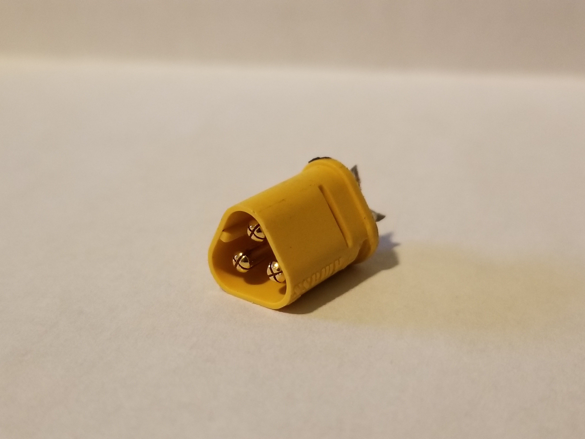
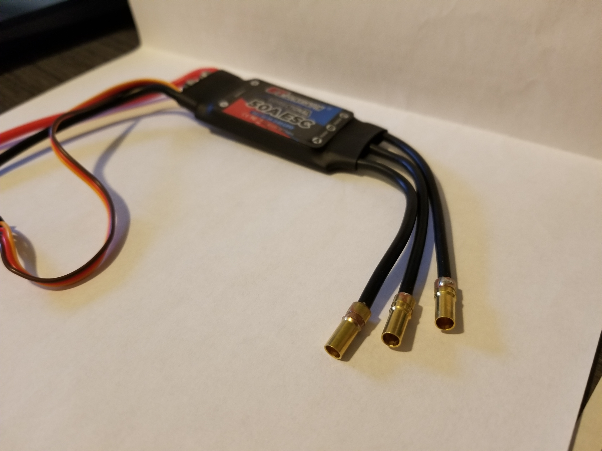
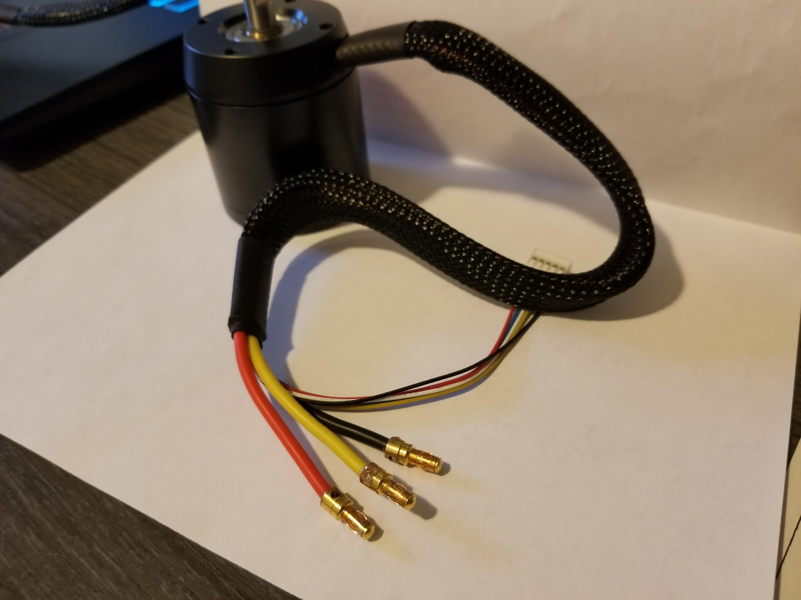

# October 21, 2023
## Electronics
The brushless motors we ordered were send with male MT30 connectors which are not convinient for several reasons:
- They are not common so difficult to source at a reasonable price
- They don't allow to swap two phases lines to reverse the rotation direction

Because the ESCs are sold without any connectors, I decided to replace the motors connectors by 3.5mm bullet connectors so we have female connectors on the ESCs and male connectors on the motors. The use of bullet connectors is much more convinient for the reasons mentioned above.

     

Once I finished soldering the connectors, I tested the motors with the ESCs and it worked perfectly. I used a 6S (22V Li-ion) battery to power the ESCs wich are rated for 3S to 6S. I powered the Arduino with the 5V output of the ESC. I mounted the motor on the 3D printed support that will later be used to mount it on the robot.

 

I wrote the following code to test the motors:

```c++
#include <Servo.h>

Servo esc;

int potPin = A0;
int throttle;

void setup() {
  esc.attach(9, 1000, 10000);
}

void loop() {
  throttle = map(analogRead(potPin), 0, 1023, 1000, 10000);
  esc.writeMicroseconds(throttle);
  delay(10);
}
```
My code is really basic, it reads the value of a potentiometer on pin **A0** and writes the value to the ESC using the library ***Servo***. The ESC then sends the corresponding three-phase PWM signal to the motor. The motor speed is proportional to the PWM signal. A video of the test can be found [here](https://github.com/Loic-LEROY/PolyMartian/blob/main/Lo%C3%AFc's%20Reports/src/session_02/run%20test.mp4) on the GitHub repository.

I was really impressed by quality of the motors, they run super smooth and are really quiet.

Here is the whole test setup:


## 3D Modeling
Based on the latest rules given by the cup administrators, we decided to change our strategy. Instead of storing the plants into the robot, we will push all of them in the same time. This way, we don't have to manipulate the plants one by one to put them in the robot. We will directly push them with the robot frame. This will conciderably reduce the time spend to collect the plants.

To match this new strategy, I modeled on SolidWorks a whole new robot. The motorisation remains the same, we still have a grabber to place the plants in the planters. Here is a comparison of the very first version and my first model of the new version:

  

> On the left le first version of the robot, on the right the new version

Before building the new robot, I already found that there is a problem with the new design. The wheels are at an extremity of the robot, so it reduces the maniability of the robot by augmenting the truning radius. To solve this issue, I will have to move the wheels closer to the center of the robot like on the first version. The problem now is that I cannot move the motors from their position because they would block the area where the plants are "stored". The solution is to let the motors where they are and to move the wheels closer to the center of the robot. This will require to use a belt transmission to connect the motors to the wheels. I will also had a belt tensioner to be able to adjust the belt tension.

Here is the new version I come up with:


> Some parts are transparent for a better visibility but they won't be transparent on the real robot.

As you can see on the image above and the images below, I also added one freewheel to each side of the robot. These wheels are not motorised, they aim to measure the distance travelled by the robot. This will allow us to know the position of the robot on the field. I will use a rotary encoder to measure the rotation of these wheels. By measuring the position of the robot on non driving wheels, we ensure that the position is not affected by the slippage of the driving wheels which can append when the robot accelerates or decelerates too much or if it loses traction due to the ground conditions like grease or dust.

   

> Some details of the mounting of the freewheels and the driving wheels.

In order to ensure a good regidity off the mounting of the driving wheels, I added a 3D printed part with a triangular shape for resistance and it creates a great pivot for the driving wheels. More over, I've modelled a system that maintains pressure on the freewheels to avoid distorting the measurements should they come off the ground due to imperfections in the playing surface. This system consists of a swinging arm to which the freewheel is pivotally attached, and which is pressed towards the ground by a spring that forces it to lower the freewheel.

For information, the spring and its support are not yet modeled on the robot model. It will be done next time; all pivot are ball-bearing mounted to reduce friction. All features from the previous version have not been added yet.

## Next time
- Finish the freewhell system
- Model the belt tensioner
- Add the previous features (already modeled for the previous version)
