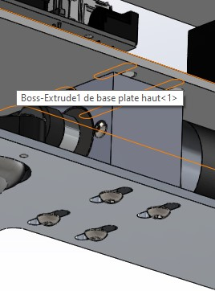
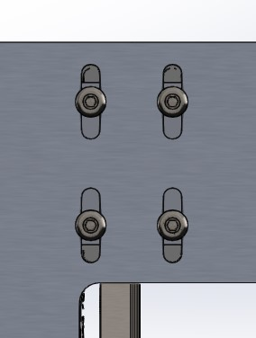
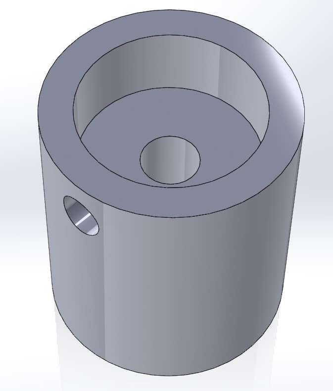
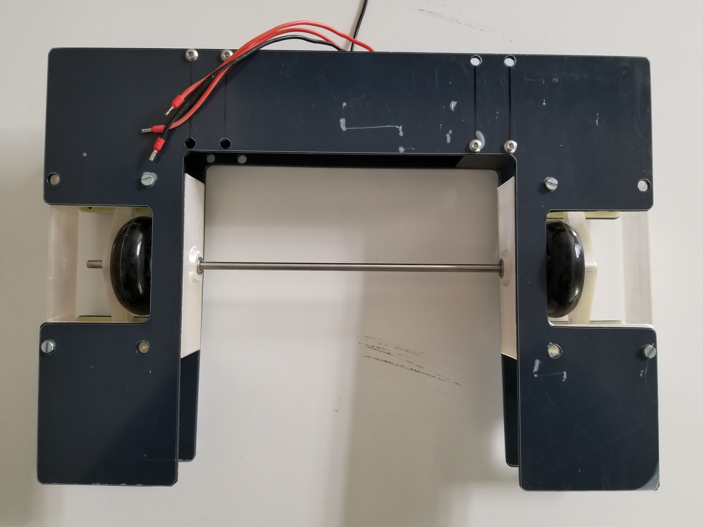
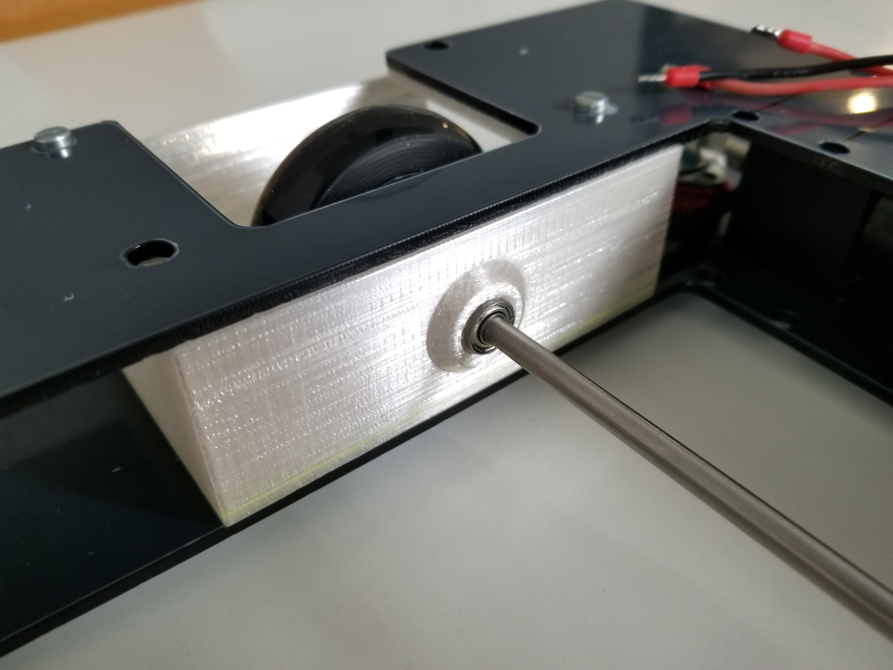
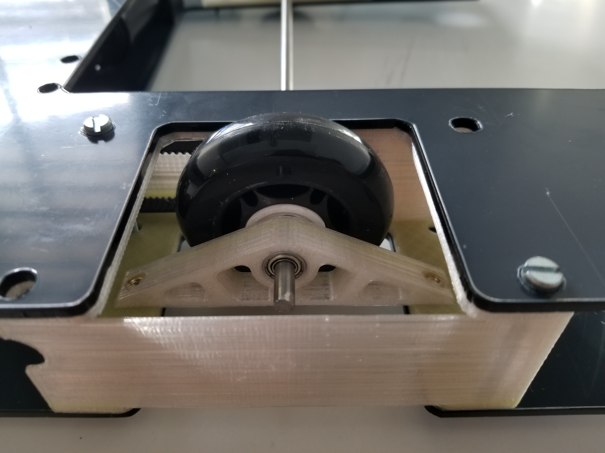
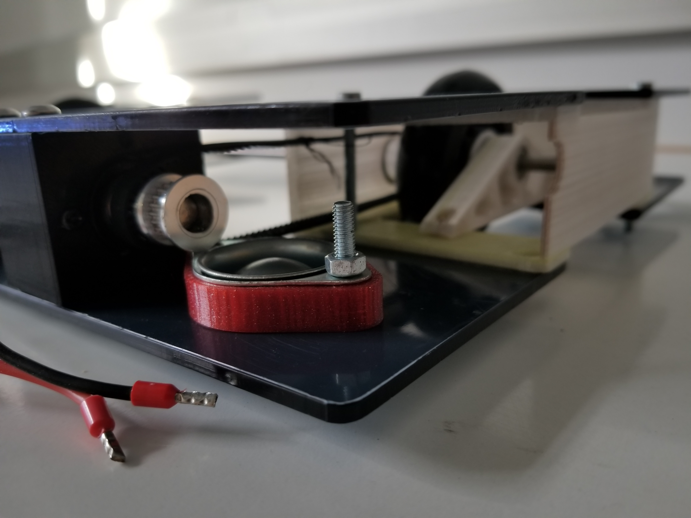
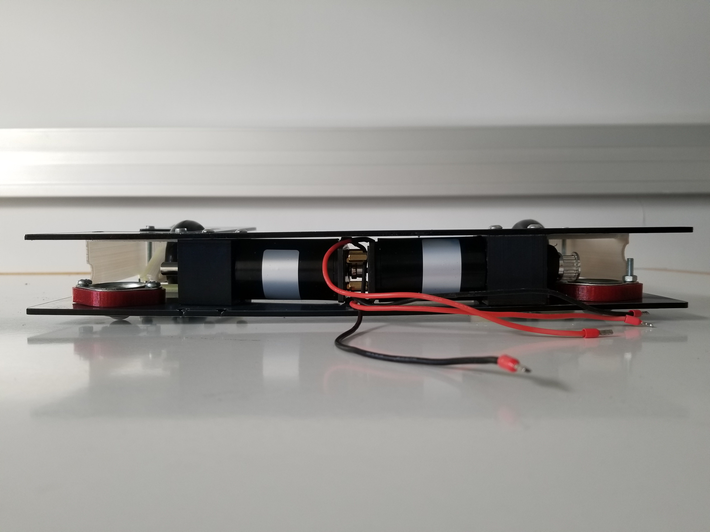

# December 12, 2023
## 3D Modeling
During this session, I modeled on SolidWorks the belt tensioner. To tension the belt, I made oblong holes in the panels of the robot's frame so the motor mounts can translate and by controlling the center to center distance between the two pulleys, I can adjust the tension of the belt.

 

> Belt tensioner

Since I mouved the wheels to the center of the robot, they are no longuer directly mounted on the motor shaft so I had to redesign the hub adapter because the motor's shaft are 8mm in diameter and the wheel's axis only 5mm. Moreover, I would like to transmit the torque from the pulley to the wheel.
I came up with the following design which aims to be pressed into the wheel and goes arround the pulley. Then a screw can be added to avoid a rotation between the wheel and the pulley.

> New wheel hub

To finish, I modeled the encoders mount. I modified the previously made pivot arm which hold the freewheel so the encoder can be mounted on it. The encoders are take from the motor. So I modeled the piece in order to ba able to reuse the encoder's screws.

 

> Encoder mount, the encoder is the green part

## 3D Printing
During the session, I printed the belt tensioner and the wheel hub. I also printed the encoder mount. All pieces are perfect. I chose to print them in PETG because it is stronger than PLA and easy to print.

## Hand Made
I spent a large part of the session to make some holes in the frame of the robot. I forgot a few holes for some screw so I had to make them. It was not difficult because I took the time to take the measures and to mark the holes before drilling them. I also mounted the ball freewheel, the new mounts. I put all the ball bearings into the different parts and the brass inserts as well.

     

> Some photos of the robot from different angles. Plastic protections had not been removed yet. Some screws are missing to save time.

## Next Session
- Cut and thread the shafts
- Finish the frame
- Mount the freewheels (coding wheels)
- Mount the grabber