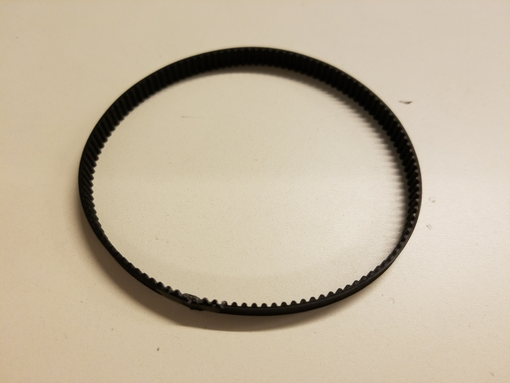
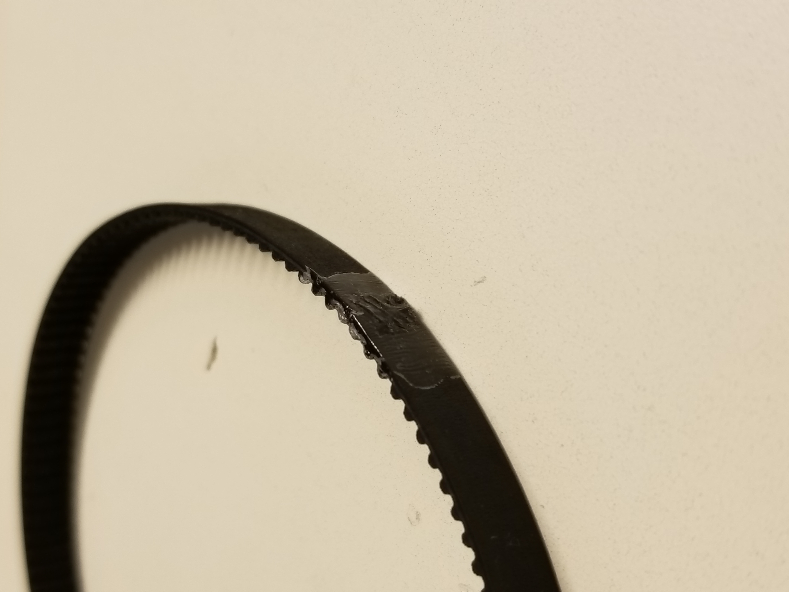
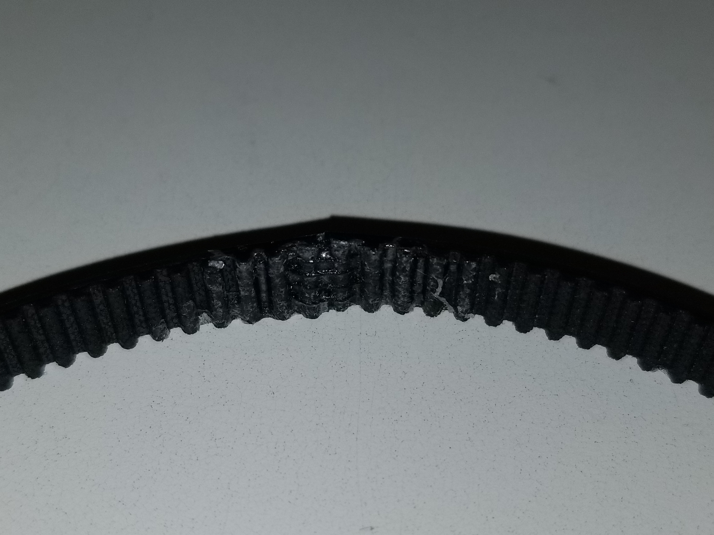

# January 08, 2024
## Hand made
### Belts
During this session, I sewed the belts for the motorized wheels. The wire provides good tensile strength and the glue prevents the wire from loosening. I used a glue which remains soft after it dries so the assembly stays flexible.

  
> An assembled belt

### Motors mounting holes
After I finished making the two needed belts, I modified the robot frame to make the motors mounting holes oblong. This allows the motors to glide along the frame and adjust the belts tension. Then, I mounted the motors and the wheels with the belts to check if everything was working properly.

 

> A 3D view of the oblong holes I made on the real frame.

### Wheels' shafts
During the last part of the session, I cutted the wheels' shafts to the right length and I tried to thread them but it didn't work because the die was damaged. I planned to thread the ends and then use nuts to stop the shafts axially. I will have to find a new die to finish this task or find another way to stop the shafts.

## Next session
- Solve the shafts problem
- Reassemble the robot entirely
- Add the vertical gripper I made previously
- Add the coding wheels I made previously