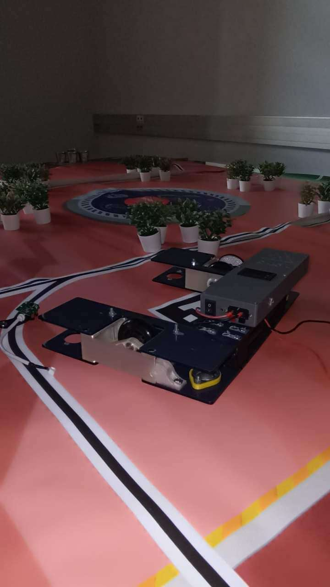
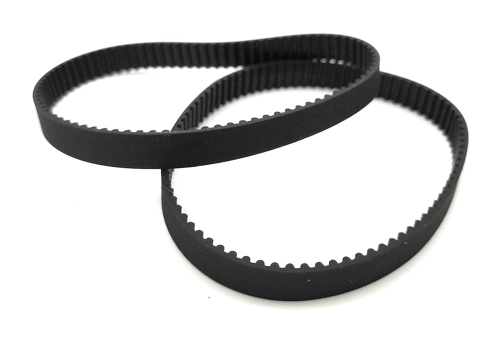

# January 16, 2024
### Robot assembly
During this session, finished to assemble the rolling base. It is now ready to be programmed and tested. The next step is to assemble the gripper. We also need to find a way to power the robot. We will probably use a battery pack. For the moment, I am using my home made portable power supply but it is not very convenient and it does not last a long time. I also assembled the coding wheels and the motor encoders. I adjusted the height of the yellow plastic parts to make sure the wheels are touching the ground and that the robot is stable.

  

> The rolling base with my portable power supply on top; a coding wheel mounted onto the rolling base.

### Mecanical power transmission
In order to transmit the power from the motors to the wheels, I chose to use a belts. Last session, I tried to make them myself by sewing the ends of a belt together. During this session, I performed a stress test on the belts by running the motors and pushing the robot against the floor. The belts broke after a few seconds. I then decided to buy some belts online. I found some that are the right size. I will receive them in a few days. I think the problem was the wire I used to sew the ends together. It was too thin and made out of cotton and it broke. Maybe if I had used a thicker wire made out of a stronger material like nylon, it would have worked.

> The belts I bought online.

While testing the belts, I noticed that the belts did not slip on the pulley so I conclued that the system to tension the belts is valid.

## Next session
- Solve the shafts problem
- Add the vertical gripper I made previously