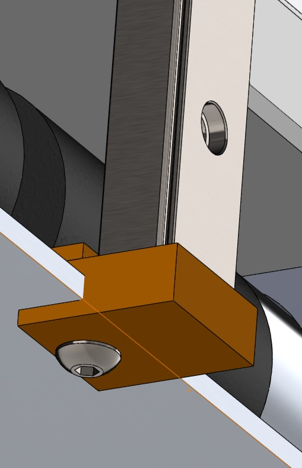
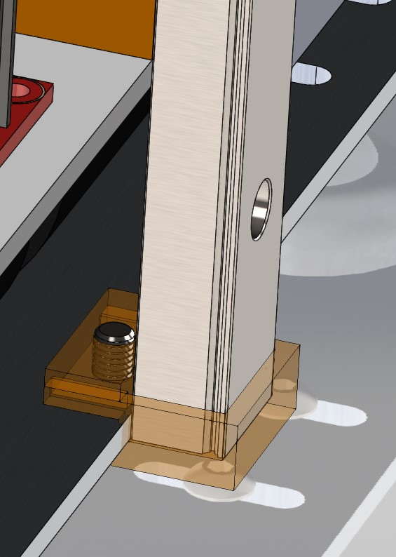
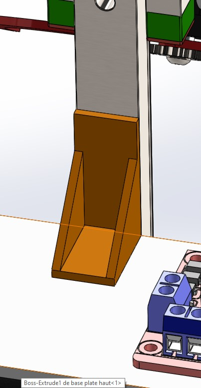
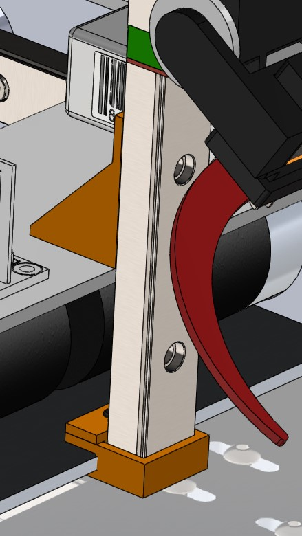
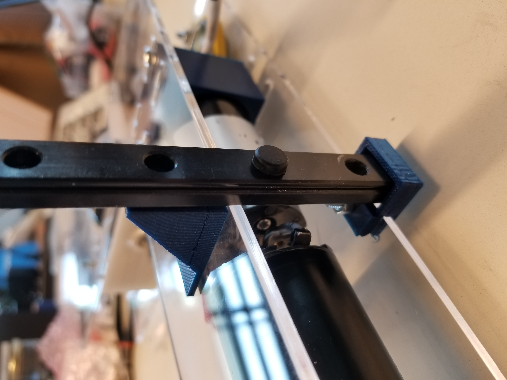
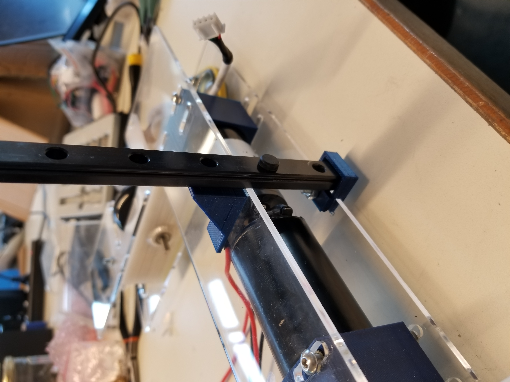
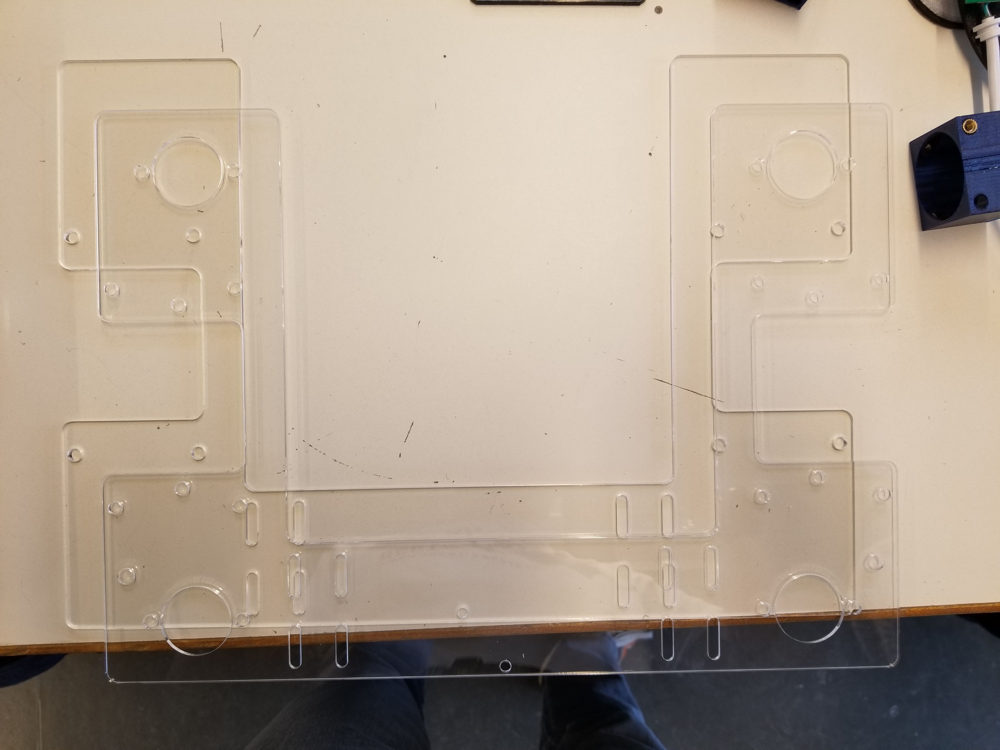
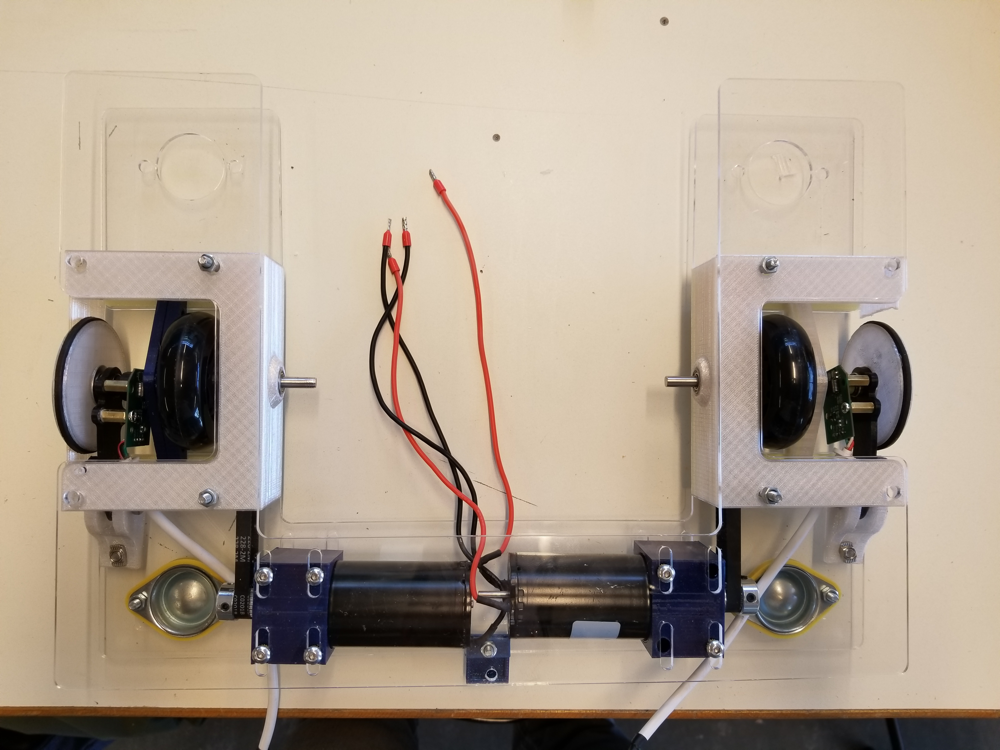
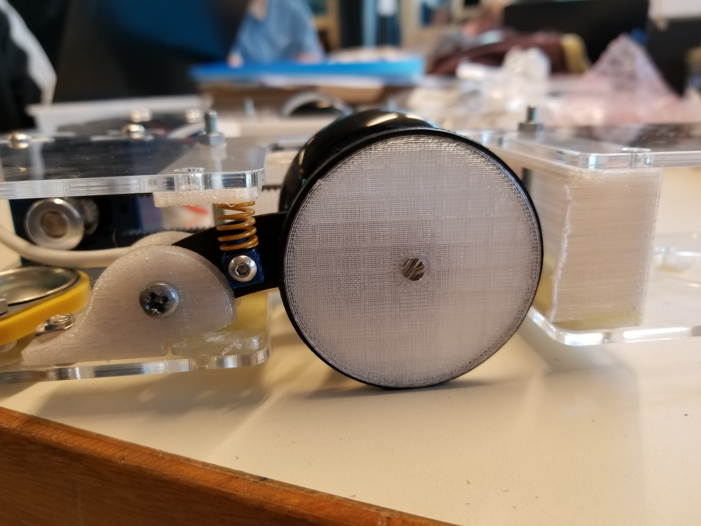
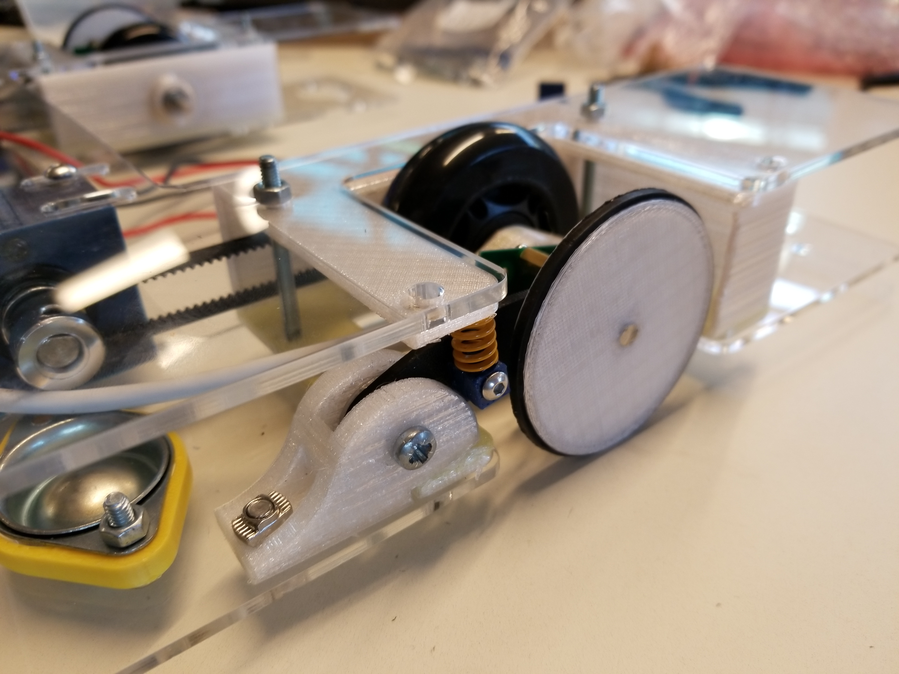

# January 23, 2024
## 3D modeling
### Vertical rail mounting
In order to mount the vertical rails, I modeled on SolidWorks two pieces which will hold the rails in place. The first one avoid the rails to move vertically by blocking it at the bottom. It also blocks all the horyzontal translations. The piece is screwed to the base of the robot. The second piece blocks the rails from the rear and blocks the vertical translations thanks to a through screw. It is screwed to the top panel of the robot's frame. The two pieces are shown below in orange.

   

> The two pieces are shown in orange

## 3D printing
### Vertical rail mounting
I printed the two pieces in PETG with a 0.2mm layer height and 50% infill. This settings are the best compromise between printing time and strength. The pieces are shown below in PrusaSlicer.

> The two pieces after slicing

 

> The two pieces after printing

## Laser cutting
### Panels' frame
Since we switched to the U-shaped frame, we made a lot of holes modifiactions. In order to keep our work clean, we decided to laser cut a new frame which includes all the holes we made after the first laser cut. Once the frame was cut, I assembled the robot with the new frame. The frame is shown below.

  

> The new frame and the robot reassembled

### Coding wheels
Last session, I assembled the coding wheels but the springs supposed to keep the wheels in contact with the ground were too strong and their supports were too weak. I made some new ones and I cutted the springs in half in order to reduce their strength.

 

> The new springs and their supports in blue printed plastic

## Next session
- Add to the robot the stepper motor to move the vertical rails.
- Design a grabber that can grab several plants at once.

