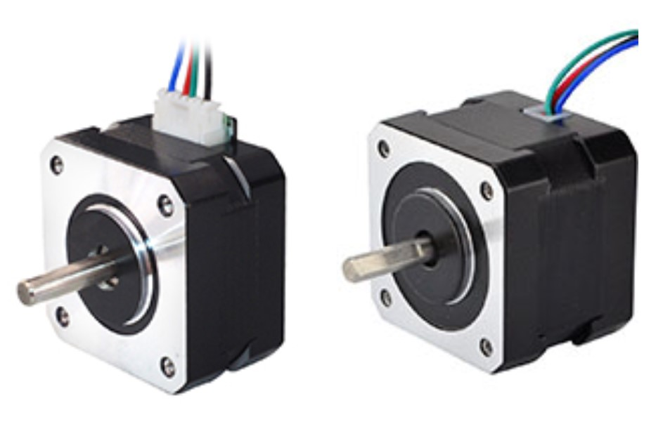
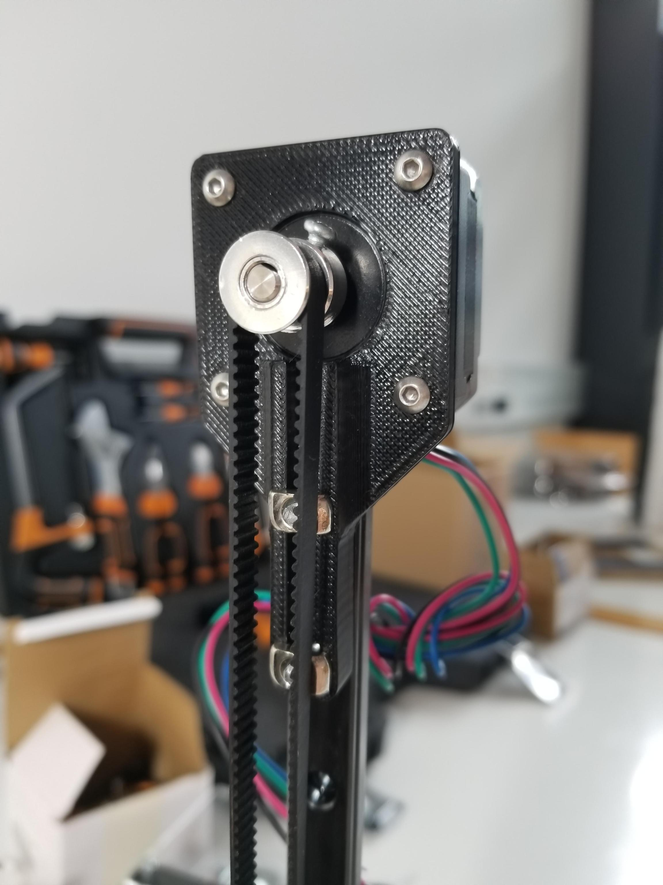
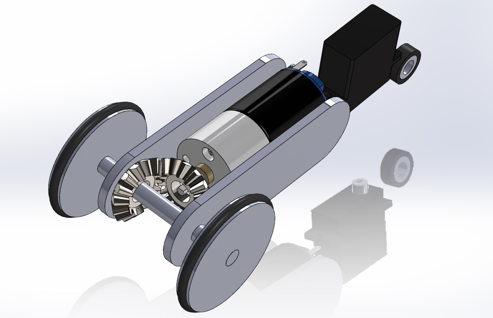

# February 07, 2024
### Vertical rail
Last session, I mounted the vertical rail onto the robot but they looked a bit fragile. I decided reprint them with a thicker wall so they are more robust. Now the vertical rail is strongly attached to the robot, I can fix the stepper motor and the pulley on it. The stepper motor I chose is a pancake Nema 17. It is the same motor as a classic Nema 17 but it is twice as thin and twice as light. The classic version has a torque of **0.26 Nm** but the pancake version has a torque of **0.16 Nm** yet it is enough for the vertical rail which is not supposed to carry a heavy load (a few tens of grams).

> Left: pancake Nema 17; Right: classic Nema 17

 

> The stepper motor is fixed on top of the vertical rail, the pulley is fixed at the bottom of the rail. The belt is around the pulley and the motor shaft and is fixed to the cart of the rail.

### Belt mount
In order to move the cart up and down, a belt is attached to it and turns around the stepper on top of the rail and a pulley at the bottom of the rail. The belt is a GT2 belt, it is a standard belt for 3D printers and CNC machines. The belt is fixed to the cart with a 3D printed part. The part is designed to be fixed to the cart with 4 screws and to hold the belt with 4 other screws which go through the part and the belt. This way, the belt is strongly attached to the cart and the part is strongly attached to the cart.

## 3D modeling
### Ladybug
Now the main robot is almost physically complete, I started to model the ladybugs. These mini robots are designed to pollinate plants picked up within the first 100 seconds by the main robot. To validate this action, every ladybug must move from the departure base to a plant placement area and touch one of the plants.

For the modeling, I used the same process as for the main robot. I started by listing the items a ladybug should carry :
- A lidar or a ultrasonic sensor (to detect the obstacles)
- A Raspberry Pi zero W (Wifi version)
- 2 motors (a DC motor for the motor wheels and a servo motor for the dircetion wheel)
- A battery (Lipo 3.7V 500mAh for its lightness and its small size)
- ...

Then I found on the internet the models of the Raspberry Pi zero and the lidar because they are standard items and it would be a waste of time to model them myself. I have an idea of the size of the motors and the battery we are going to use, so I modeled them myself. Now I have all the models of the main componants, I can start to design the chassis of the ladybug.

> First draft of the ladybug. Ultra compact and light.

## Next session
- Mount the new wheels on the main robot
- Update the grabber's design to fit the vertical rail's belt mount
- Design the main robot's horyzontal rails
- Mount them on the robot
- Model the ladybug's chassis