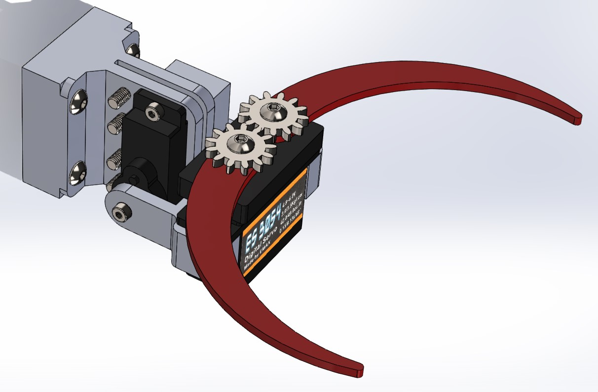
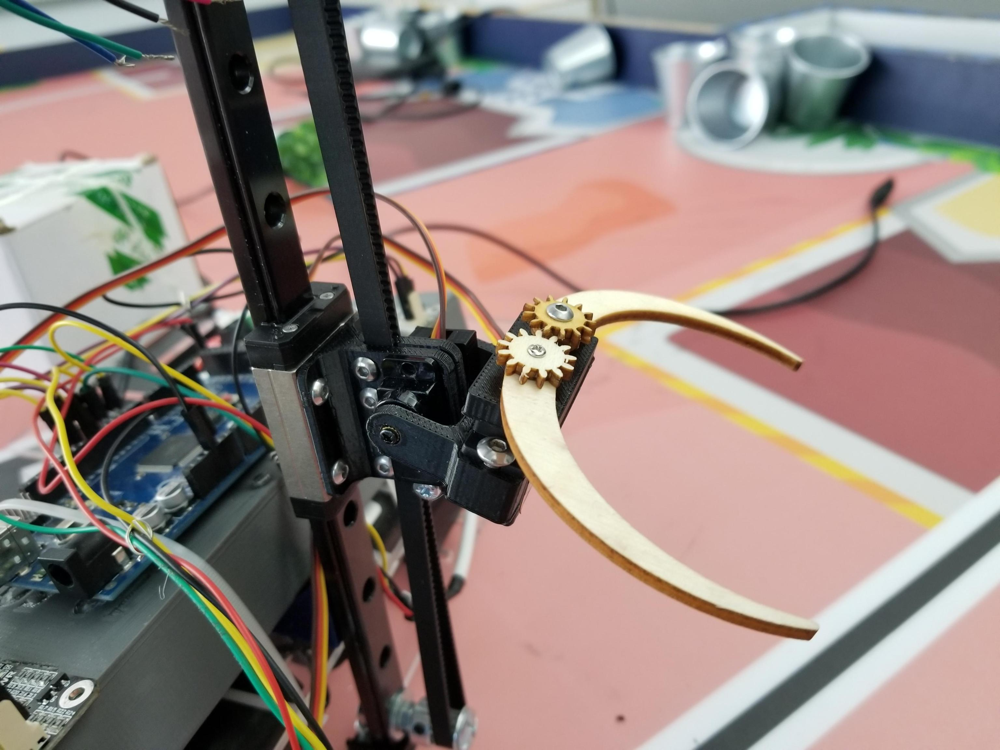
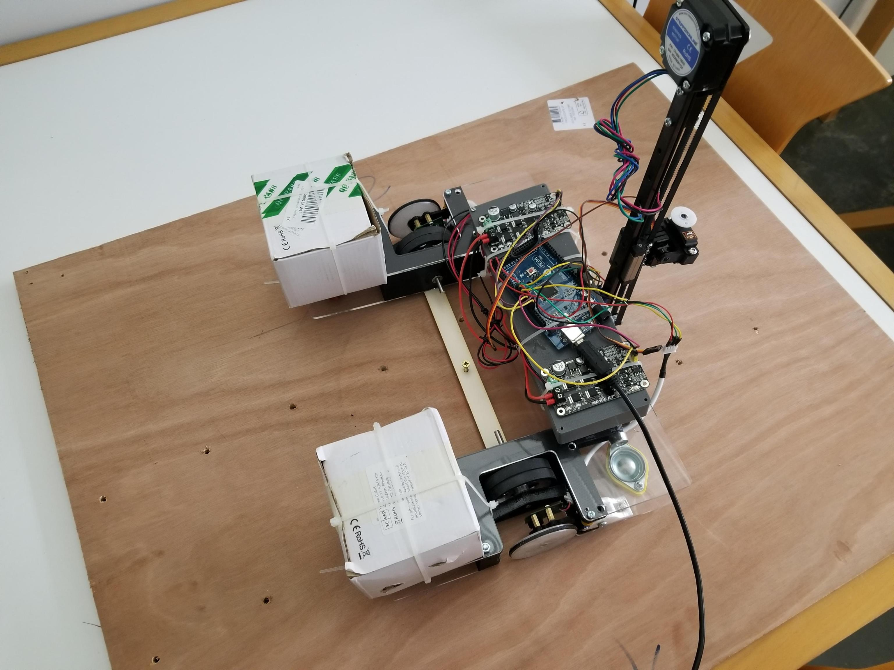

# February 14, 2024
## Grabber
During this session, I modeled, 3d printed, and assembled the grabber. One to tilt the gripper forward and one to open and close the gripper hooks. I use servos because they are very easy to command and very compact compared to their strength. The part that holds the grabber is also used to secure the rail belt. Thera are four screws that go through the belt in order to pinch it so it can not glide off the part.

 

> The upgraded grabber

## Wheels
After a few tests, we found up that the wheels we were using on the robot were not straight at all (buckling of approx. 3 mm) so we ordered some new ones made out of aluminum and rubber arround. After mounting then, I observed that they are almost perfect. Unfortunatelly the wheels are finner than the old one so we have to put two of them in parallel to get the same width.

 

> The new wheels

## Calibration
In order to calibrate the robot's encoder wheels, I modeled in SolidWorks and then laser-cut a plate to fix the robot's center of inertia at a fixed point. This enables the robot to be rotated around a perfectly fixed axis of rotation, and the number of steps taken by each encoder wheel to be counted, so as to check whether or not they are identical, or even to determine a coefficient of divergence between the two. The part is screwed to the robot at both ends, and screwed to a panel on which the robot rolls.

> The robot on the test bench. The part I've added is the light wood part in the middle of the robot.

## Next session
- Design, print and mount the horyzontal rails on the robot.
- Continued progress on ladybug design